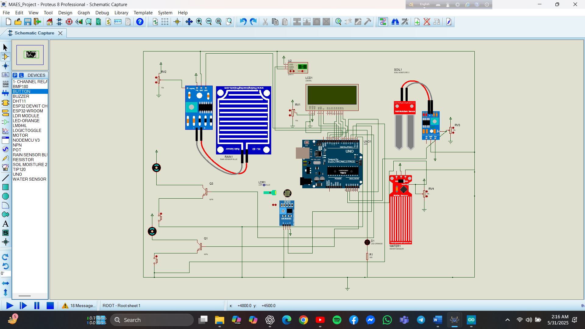

# 🌾 SMART AGRICULTURAL AUTOMATION SYSTEM



---

**Arduino Was used in the simulation as the ESP32 board was not working in the simulation as the teams simulation expert stated**

---

## 🧠 Overview

**SMART AGRICULTURAL AUTOMATION SYSTEM** is a microcontroller-based project that automates irrigation and monitors agricultural field conditions using sensors and a web interface.  
It leverages **ESP32**, **IoT sensors**, and **web connectivity** to intelligently manage irrigation — conserving water, reducing labor, and improving crop yield.

---

## ⚙️ Key Features

- 🌱 **Real-time monitoring** of soil moisture, humidity, and temperature.  
- 💧 **Automatic irrigation** when moisture falls below a threshold.  
- 🌐 **Web-based dashboard** for monitoring and control.  
- ⚡ **Actuator control** (relays, pumps, and valves).  
- 🧩 **Scalable architecture** — easily add new sensors or expand zones.  
- 🔒 **Reliable and low-cost** solution for smart farming.

---

## 🏗️ System Architecture

Sensors → Microcontroller (Arduino) → Web Server/API → Web Dashboard<br>
↓<br>
Actuators/Relays (pump, valves)<br>

- **Sensors** collect environmental data (moisture, humidity, temperature).  
- **Arduino** processes readings, applies logic, and triggers relays.  
- **Web interface** displays real-time data and allows manual control.  
- **Actuators** respond by turning irrigation systems on or off.

---

## 🔩 Hardware Components

- ESP32 Board 
- Soil Moisture Sensor  
- DHT11 / DHT22 Sensor (Temperature & Humidity)  
- Relay Module (for pumps/valves)  
- Water Pump or Solenoid Valve  
- Optional: WiFi or Ethernet Module for Web Access  

---

## 💻 Software Components

- Arduino IDE  
- C++ / Arduino code: `project_code_with_web.ino`  
- Web-based dashboard (served via Arduino or local server)  
- Configurable thresholds for soil moisture and environmental conditions  

---

## 🚀 Setup & Installation

### Prerequisites
- Arduino IDE installed  
- Connected hardware (sensors, relays, power supply)  
- WiFi/Ethernet network for remote control  
- Basic knowledge of Arduino wiring  

### Steps
1. **Clone the repository**  
   ```bash
   git clone https://github.com/AkibAshfaq/SMART-AGRICULTURAL-AUTOMATION-SYSTEM.git

2. Open the file `project_code_with_web.ino` in Arduino IDE  
3. Edit WiFi credentials and pin configurations if needed  
4. Upload the sketch to your Arduino board  
5. Power up the system and ensure all sensors are connected properly  
6. Access the dashboard through the provided local IP (e.g., `http://192.168.x.x/`)  

---

## 📊 Usage

- Continuously monitors soil moisture and climate data  
- Automatically activates irrigation when moisture drops below threshold  
- Web dashboard allows:
  - Viewing real-time data  
  - Manual control of pumps or valves  
  - Adjustment of threshold values  

---

## 🌟 Benefits

- 💦 **Efficient water management** — reduces water waste  
- 👨‍🌾 **Reduces manual labor** — fully automated control  
- 📈 **Improves crop yield** through data-driven irrigation  
- ⚙️ **Easily customizable** for any farm size  
- 💰 **Low-cost and sustainable** technology solution  

---

## 🔮 Future Enhancements

- Multi-zone irrigation control  
- Integration with cloud services for analytics  
- Mobile app for live monitoring and notifications  
- AI-based prediction for irrigation timing  
- Solar-powered automation module  

---

## 🧩 Project Structure

SMART-AGRICULTURAL-AUTOMATION-SYSTEM/<br>
│<br>
├── project_code_with_web.ino # Main Arduino code<br>
├── images/ # Screenshots folder<br>
├── README.md # Project documentation<br>
└── LICENSE # License file (MIT recommended)<br>


## 🙏 Acknowledgment

Developed by **Akib Ashfaq's team** as part of an effort to promote **Smart Agricultural Innovation** using IoT and embedded systems.  
Special thanks to open-source communities for hardware and Arduino library support.